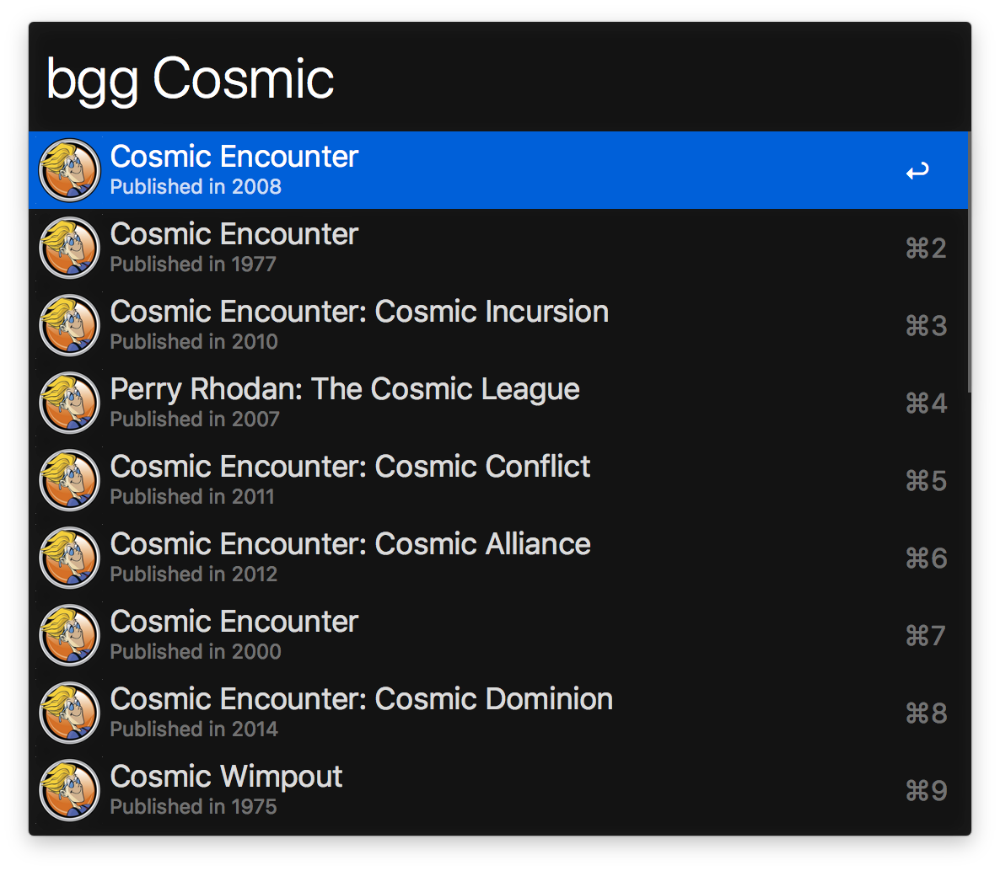

# BoardGameGeek Workflow

Search BoardGameGeek from the comfort of Alfred.



## Install

```sh
npm install --global alfred-boardgamegeek
```

*Requires [Node.js](https://nodejs.org) 14+ and the Alfred
[Powerpack](https://www.alfredapp.com/powerpack/).*

## Usage

In Alfred, type `bgg` then your query to search for BoardGameGeek games. Hit
<kbd>Enter</kbd> to go to the game's BoardGameGeek page.

## License

MIT © [Wes Baker](http://wesbaker.com)
